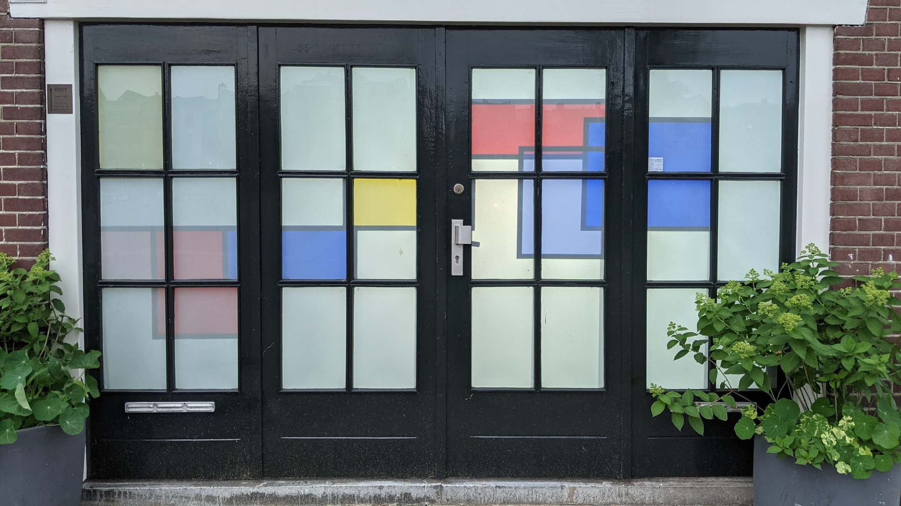
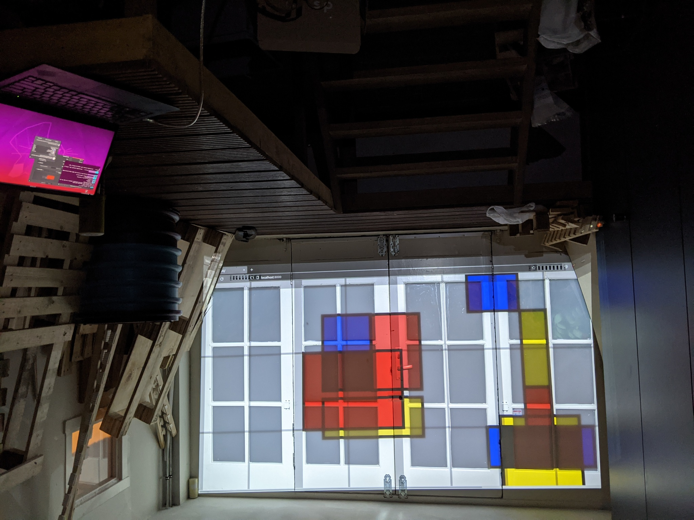

Mondrian Garage Door sketch
===

See it in action: https://osresearch.github.io/mondriaan/

* Hit 'f' to toggle full screen mode.
* Hit `b` to toggle between bright and dark mode.
* Click the four corners to align it to your wall.
* Hover the mouse and hit space to log the UV space coordinates



The sizes and locations of the bars are specific to the installation.
You can move them around by changing the `dividers` array to set
change where they are.

The XY drawing coordinates are translated into UV screen coordinates
using a perspecive transform:

```
u = (x * c00 + y * c01 + c02) / (1 + c20 * x + c21 * y)
v = (x * c10 + y * c11 + c12) / (1 + c20 * x + c21 * y)
```

Given four (xi,yi) to (ui,vi) points, this produces a system of eight
equations with eight unknowns.  Re-arranging the equations into
an alternate form:

```
u * (1 + c20 * x + c21 * y) = (x * c00 + y * c01 + c02)
u = x * c00 + y * c01 + c02 - u * c20 * x - u * c21 * y 
```

and

```
v * (1 + c20 * x + c21 * y) = (x * c10 + y * c11 + c12)
v = x * c10 + y * c11 + c12 - u * c20 * x - u * c21 * y 
```

This form makes it possible to produce a linear system
of the equations, and solving the system generates
the projection matrix coefficients
([borrowed from OpenCV](https://github.com/opencv/opencv/blob/68d15fc62edad980f1ffa15ee478438335f39cc3/modules/imgproc/src/imgwarp.cpp#L3253)):

```
/ x0 y0  1  0  0  0 -x0*u0 -y0*u0 \ /c00\ /u0\
| x1 y1  1  0  0  0 -x1*u1 -y1*u1 | |c01| |u1|
| x2 y2  1  0  0  0 -x2*u2 -y2*u2 | |c02| |u2|
| x3 y3  1  0  0  0 -x3*u3 -y3*u3 |.|c10|=|u3|,
|  0  0  0 x0 y0  1 -x0*v0 -y0*v0 | |c11| |v0|
|  0  0  0 x1 y1  1 -x1*v1 -y1*v1 | |c12| |v1|
|  0  0  0 x2 y2  1 -x2*v2 -y2*v2 | |c20| |v2|
\  0  0  0 x3 y3  1 -x3*v3 -y3*v3 / \c21/ \v3/
```

This matrix *should* be passable to p5js `applyMatrix()`, which
works in `WEBGL` canvas to allow arbitrary transforms, but
the current code is instead doing its own skewing.
Something wasn't right and that was easier for now.
